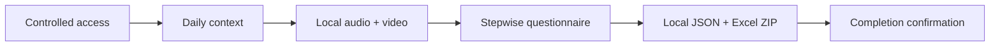

# Physical Stimulation Intervention Session Companion

A Chrome-first, privacy-conscious workflow for guided home intervention sessions. The application joins controlled access, daily context, browser-local audiovisual recording, stepwise structured questionnaires, local response export, and completion confirmation in one quiet, sequential interface.

面向居家干预场景的完整会话工具：受控进入、当日状态、本地音视频、分步结构化作答、本地资料包和完成确认在同一条低认知负担流程中完成。

[Open the controlled application / 打开受控应用](https://physical-stimulation-session-recorder.streamlit.app)

<p align="center">
  
</p>

## Complete Session Flow



| Stage | Participant experience | Data boundary |
| --- | --- | --- |
| Controlled access | Password or signed participant link | No access credential is committed to Git |
| Daily context | Compact check-in before the session | Held in transient session memory and included in the local response package |
| Local recording | Camera preview, microphone meter, recording, playback, and explicit confirmation | WebM bytes stay in Chrome and are never uploaded |
| Structured questionnaire | One focused step at a time with applicable follow-ups | No participant-facing totals, thresholds, interpretations, or risk labels |
| Local export | One ZIP with equivalent JSON and Excel records | Generated in session memory and downloaded by the participant |
| Completion | Explicit confirmation after local files are checked | No durable server-side response storage |

## Questionnaire Experience

The operational flow uses stable controls, visible progress, conditional follow-ups, required-response checks, and a direct support message when the configured safety condition applies. Participant-facing pages do not display calculated scores or interpretations.

正式流程采用稳定控件、可见进度、条件分支和必答检查；满足预设安全条件时直接显示支持信息。受试者端不展示总分、阈值、解释或风险标签。

## Local-First Recording

- **Demo mode:** up to 5 minutes in browser memory, followed by local playback and download.
- **Long-session mode:** up to 45 minutes written directly to a Chrome-selected local file.
- Camera and microphone tracks are released after finalization, failure, skip, or reset.
- Download alone does not prove a disk write. The participant must open the local file, check video and sound, then explicitly continue to the questionnaire.

Media files are separate from the response ZIP and must be checked independently. No recording bytes are sent to Streamlit or durable server storage.

## Run Locally

Requirements: current desktop Chrome and Python 3.10+.

```powershell
python -m pip install -r requirements-dev.txt
python -m streamlit run app.py
```

Open `http://localhost:8501` in Chrome. The operational entry point is **`app.py`**, not `showcase_app.py`.

## Deploy on Streamlit Community Cloud

Create an app with these source settings:

| Setting | Value |
| --- | --- |
| Repository | `YaoZeLiu0417/physical-stimulation-session-recorder` |
| Branch | `main` |
| Main file path | `app.py` |

Configure required values only in Streamlit **Secrets**. Never commit secret values to this repository.

- `APP_PASSWORD_SHA256`
- `LINK_SIGNING_KEY`
- `TRUSTED_INTERVENTION_DAYS`
- `SAFETY_CONTACT`

After saving settings, reboot the app and confirm that the title is **问卷会话**.

## Verification

```powershell
python -m pytest -q
node --test tests/js/test_recorder_core.mjs
python -m py_compile app.py browser_recorder.py local_recording_workflow.py
```

The test suite covers authentication boundaries, recorder lifecycle, stopped-to-questionnaire handoff, conditional questionnaire flow, local JSON/Excel export, archive validation, cleanup, and the privacy-safe showcase audit.

## Public Presentation Guide

The separate public presentation repository contains the visual walkthrough, synthetic screenshots, animated workflow, Chrome guide, troubleshooting, and privacy explanation:

[View the presentation README / 查看展示页](https://github.com/YaoZeLiu0417/physical-stimulation-session-recorder-showcase)

This repository contains application source but no real participant recordings, response packages, access credentials, or secret values.
