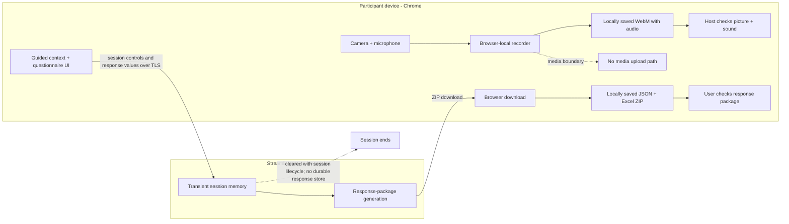

# Physical Stimulation Intervention Session Companion

A calm, Chrome-first companion for guided home sessions: controlled entry, local media capture, focused responses, and explicit save confirmation in one sequential flow.

面向居家会话的安静、清晰工作流：从受控进入、本地音视频和分步作答，到资料保存与完成确认，全程保持边界可见。

[Open the controlled application / 打开受控应用](https://physical-stimulation-session-recorder.streamlit.app)


<details>
<summary>Static workflow fallback / 静态流程图</summary>


</details>

| Stage | Purpose / 目的 | Completion signal / 完成标志 |
| --- | --- | --- |
| 01 · Controlled access | Open the guided session / 进入受控会话 | Access accepted / 进入成功 |
| 02 · Daily context | Confirm today’s context / 确认当日状态 | Required context complete / 必填信息完成 |
| 03 · Browser-local recording | Record and review locally / 本地录制并检查 | Local WebM checked / 已检查本地录像 |
| 04 · Stepwise questionnaire | Complete one focused step at a time / 分步结构化作答 | Required steps complete / 必答步骤完成 |
| 05 · Local response package | Save the response archive / 保存本地资料包 | ZIP checked locally / 已检查本地资料包 |
| 06 · Completion confirmation | Close the guided session / 确认会话完成 | Both local saves confirmed / 两类文件均已确认 |

## Questionnaire Experience


The questionnaire keeps attention on one step at a time. Applicable follow-ups appear only when needed, required-response checks prevent an incomplete handoff, and direct support copy appears when the configured condition calls for it. **No participant-facing scores** are shown.

问卷一次只聚焦一个步骤；适用的后续步骤按需出现，完成检查会提示遗漏，满足已配置条件时直接呈现支持信息。参与者页面不显示分数或解释。

The interface describes progress and next actions without exposing item wording, response values, calculations, or interpretations in this public guide.

## Local-First Recording


Current desktop Chrome captures a browser-local WebM with audio. Preview, recording, playback, and download happen through the browser; media bytes are not uploaded to Streamlit. Camera and microphone tracks are released after finalization, failure, skip, or reset.

The host must open the saved file, check both picture and sound, and then use the host-level confirmation concept **“我已下载并检查录像，继续填写问卷”**. A browser download event alone is not treated as proof that the file was saved correctly.

Questionnaire and context values live only in transient Streamlit session memory while the flow is active. They are separate from the WebM and do not create a durable server-side response record.

## Local Response Export


The response export is a local **JSON + Excel ZIP**: JSON provides a structured copy and Excel provides a readable workbook copy of the same response record. The user downloads the ZIP, opens it locally, and explicitly confirms that the response package was saved and checked. Recording confirmation and response-package confirmation remain separate so neither file can silently stand in for the other.

## Privacy And Data Boundary



The two boundaries matter: audiovisual bytes stay inside Chrome until the user saves the WebM, while context and questionnaire values pass to transient Streamlit session memory so the local response package can be generated. This application does not treat the server as a durable recording or response archive.

## Operational Palette


Deep navy `#000035` anchors navigation and text; rose `#DD1D86` marks the current action. Violet structures progress, cyan communicates readiness, and peach marks quiet checkpoints. White and mist keep the workspace readable.

## Chrome Guide

1. Open the controlled application in current desktop Chrome.
2. Allow camera and microphone access when Chrome asks.
3. Confirm the daily context, then preview and record the session.
4. Stop, play back, download, and inspect the WebM with audio before continuing.
5. Complete each questionnaire step and any applicable follow-up.
6. Download and inspect the JSON + Excel ZIP, then confirm completion.

## Troubleshooting

| Symptom | Check |
| --- | --- |
| Camera or microphone is unavailable | Use desktop Chrome, close other apps using the device, check site permissions, then reload. |
| Recording does not begin | Confirm both readiness indicators and keep the active tab open. |
| Download appears missing | Open Chrome downloads, locate the local file, and verify it before confirming. |
| Playback has no sound | Check the selected microphone, system input level, and the downloaded WebM in a local player. |
| A questionnaire step will not advance | Complete every visible required control, including any applicable follow-up. |
| Session state is lost after a refresh | Restart the guided flow; response values are intentionally held only in transient session memory. |

<details>
<summary>Local setup / 本地运行</summary>

Use Python 3.10+ and current desktop Chrome. The operational entry point is `app.py`.

```powershell
python -m pip install -r requirements-dev.txt
python -m streamlit run app.py
```

Open `http://localhost:8501` in Chrome. Allow camera and microphone access only for the local app origin.

</details>

<details>
<summary>Streamlit deployment and secret key names</summary>

Create the Streamlit Community Cloud app from this repository, select branch `main`, and set the main file path to `app.py`. Configure values only in the Streamlit Secrets editor; never commit their values.

```toml
APP_PASSWORD_SHA256 = "<configured in Streamlit>"
LINK_SIGNING_KEY = "<configured in Streamlit>"
TRUSTED_INTERVENTION_DAYS = { }
SAFETY_CONTACT = "<configured support copy>"
```

After updating settings, reboot the app and verify controlled entry, browser permissions, local recording, questionnaire progression, and both save confirmations.

</details>

<details>
<summary>Verification commands</summary>

```powershell
python -m pytest -q
node --test tests/js/test_recorder_core.mjs
python -m py_compile app.py browser_recorder.py local_recording_workflow.py tools/generate_operational_readme_assets.py
```

The focused README contract is available as `python -m pytest tests/test_operational_readme.py -q`.

</details>

## Presentation Reference

For a separate synthetic presentation of the workflow, see the [public showcase repository](https://github.com/YaoZeLiu0417/physical-stimulation-session-recorder-showcase).
