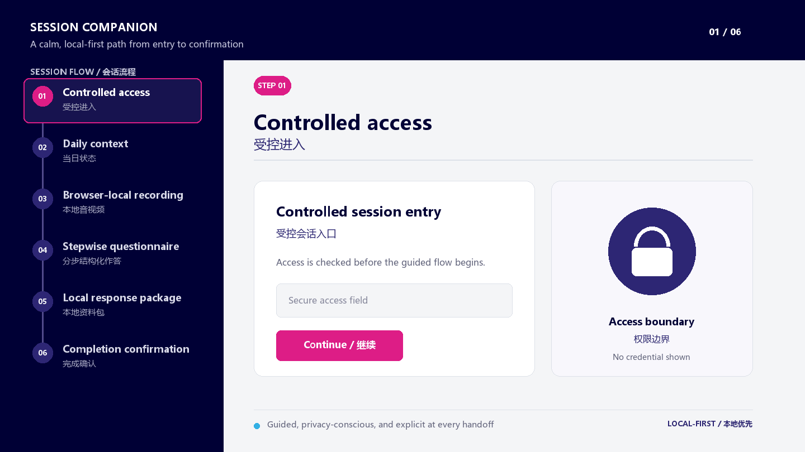
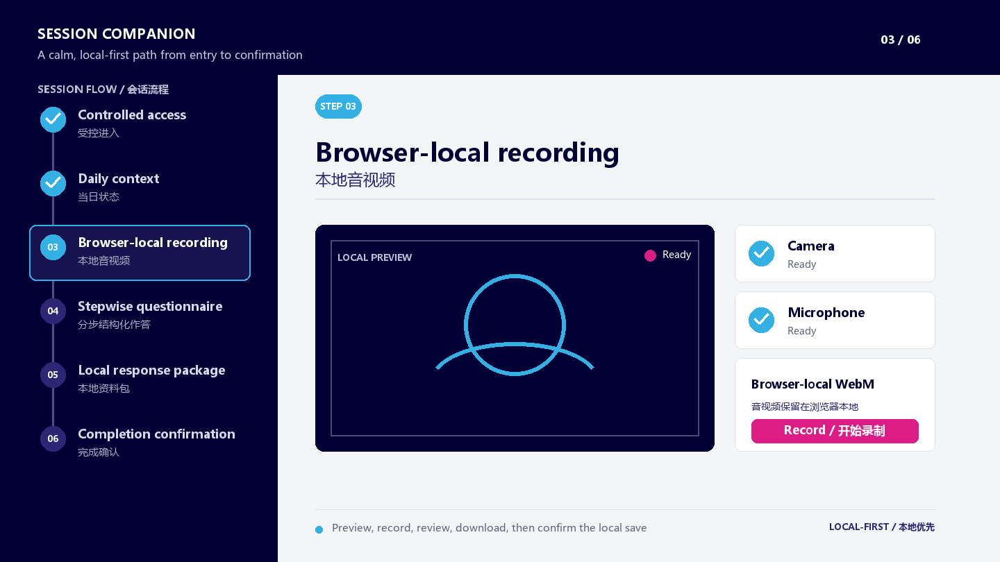
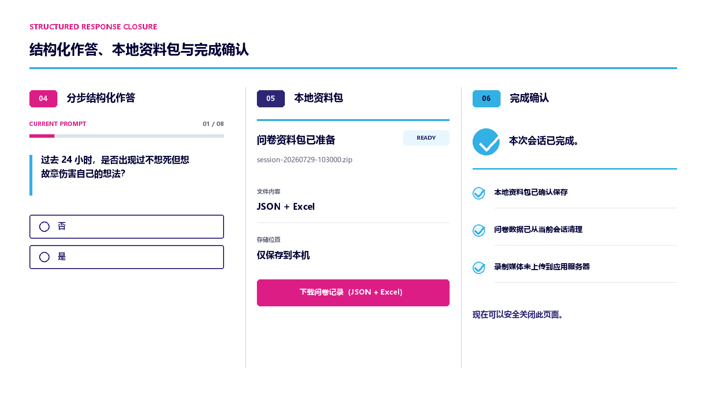
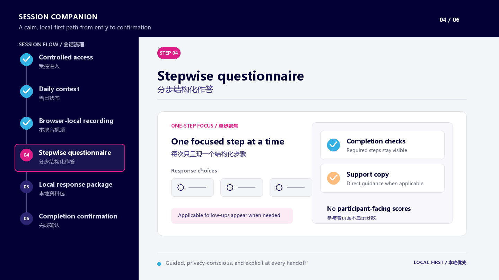
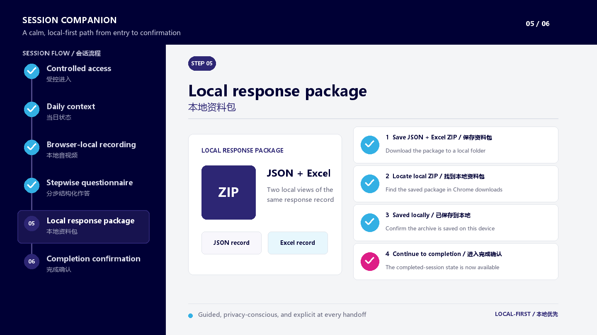
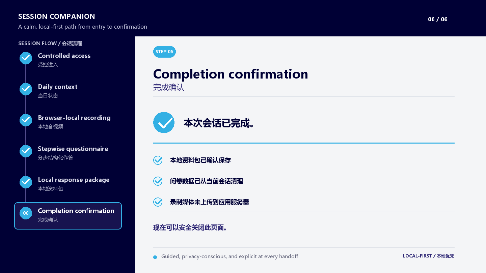
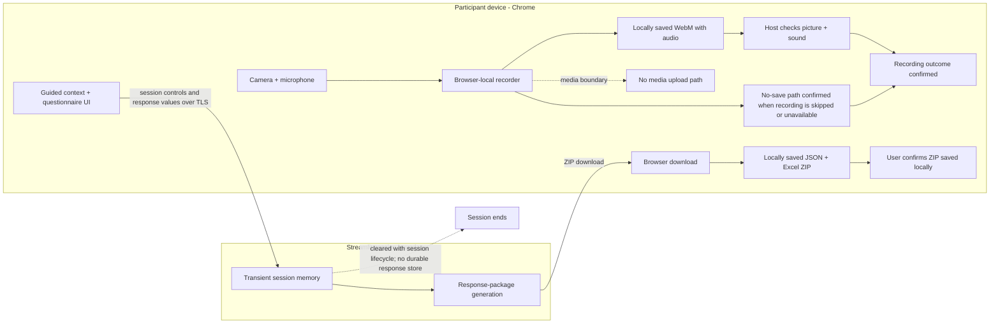

# 物理刺激干预日志
Physical Stimulation Intervention Session Companion

这是面向居家物理刺激干预研究的六阶段受控会话工具，将受控进入、当日记录、浏览器本地录制、分步结构化作答、本地资料包和完成确认组织为一条可核验的操作闭环。




<details>
<summary>流程概览</summary>


</details>

| 阶段 / Stage | 目的 / Purpose | 完成状态 / Completion status |
| --- | --- | --- |
| 01 · 受控进入 / Controlled access | 建立受控会话入口 / Open the controlled session | 进入成功 / Access accepted |
| 02 · 当日状态 / Daily context | 确认当日状态记录 / Confirm the daily context | 必填信息完成 / Required context complete |
| 03 · 本地音视频 / Browser-local recording | 在浏览器本地录制并核验 / Record and review inside the browser | 本地录像已检查，或已确认不保存 / Local WebM checked or no-save path confirmed |
| 04 · 分步结构化作答 / Stepwise questionnaire | 逐题完成适用的结构化步骤 / Complete applicable structured steps one at a time | 必答步骤完成 / Required steps complete |
| 05 · 本地资料包 / Local response package | 下载并确认本地资料包 / Download and confirm the local response package | 已确认 ZIP 保存到本地 / ZIP save confirmed locally |
| 06 · 完成确认 / Completion confirmation | 清理会话并确认流程结束 / Clear the session and confirm completion | 录制结果与 ZIP 保存均已确认 / Recording outcome and ZIP save confirmed |

## 实际界面与操作

### 本地录制 / Browser-local recording



当前桌面版 Chrome 在浏览器内提供摄像头预览与麦克风状态确认，视频预览保持静音。录制结束后，操作人员先下载 WebM，再在本机打开已保存文件，回放检查画面和声音，最后明确确认“我已下载并检查录像，继续填写问卷”；如果录制被跳过或不可用，则走清晰的不保存路径，并确认“我确认继续填写问卷，不保存本次录制”。

Current desktop Chrome shows a muted camera preview and microphone readiness, then creates a browser-local **WebM with audio**. After recording, the operator first downloads the WebM, opens the saved file locally to play it back and check picture and sound, and only then provides Recording-outcome confirmation. This distinguishes a checked local file from an explicit no-save path.



### 分步结构化作答 / Stepwise questionnaire



界面一次呈现一道题，仅在适用时展开分支题，并通过必答检查和进度提示防止遗漏；满足已配置条件时直接呈现支持信息，不向参与者显示分数或解释。代表题示例：`过去 24 小时，是否出现过不想死但想故意伤害自己的想法？`

The questionnaire presents one required step at a time, opens applicable branches only when needed, and provides direct support information without participant-facing scores or interpretations.

### 05 本地资料包 / Local response package



作答记录生成本地 **JSON + Excel** ZIP：JSON 保留结构化副本，Excel 提供可阅读的工作簿副本。操作人员下载资料包、在 Chrome 下载记录中定位文件，并确认“我确认问卷 ZIP 已保存到本地”后，才解锁完成阶段。

The user downloads the package and explicitly confirms the package was saved locally. Recording-outcome confirmation remains separate from response-package confirmation, so a no-save recording path is never mistaken for saved media.

### 06 完成确认 / Completion confirmation



完成页确认本地资料已保存、问卷会话数据已清理，并明确说明录制媒体**未上传到应用服务器**；此时可以结束本次会话。媒体不进入应用上传路径，本地文件仍由操作人员自行保管。

Completion confirms the local response package, clears questionnaire data from the active session, and reiterates that recording media remains local.

## 方法与数据边界 / Method and data boundary

- 摄像头和麦克风只进入 Chrome 本地录制器，由操作人员自行保存 WebM；应用没有媒体上传路径。
- 当日状态和问卷值在整个活动流程中保留于 Streamlit 临时会话内存，以生成本地 ZIP，并在完成时清理；不将服务器作为持久档案。



Audiovisual bytes remain inside Chrome until the user saves the WebM. Context and questionnaire values remain in transient Streamlit session memory throughout the active flow so the local response package can be generated, and are cleared at completion; the server is not treated as a durable recording or response archive.

## 验证证据 / Verification

- 六阶段门禁与清理：验证各阶段只能按顺序进入，完成页触发活动会话数据清理。
- 问卷交互：验证适用分支、必答校验、进度更新和支持信息呈现。
- 本地资料包：验证 ZIP bytes、filename、MIME、本地下载行为与人工保存确认。
- 浏览器录制：验证本地录制器状态机、媒体轨道清理和媒体无网络传输边界。
- 公开展示合同：验证 README 素材库存、尺寸、链接、可复现生成、metadata 与公开安全约束。

<details>
<summary>Chrome 操作与故障排查 / Chrome guide and troubleshooting</summary>

1. 使用当前桌面版 Chrome 打开受控应用，并在浏览器询问时允许摄像头和麦克风权限。
2. 确认当日记录后预览并录制；录制完成时停止，下载 WebM，打开本机已保存文件，检查画面和声音并确认；跳过或不可用时明确确认不保存路径。
3. 逐题完成当前必答项及适用分支，下载 JSON + Excel ZIP，在 Chrome 下载记录中定位并确认本地保存，最后完成会话。

| 现象 / Symptom | 检查 / Check |
| --- | --- |
| 摄像头或麦克风不可用 / Camera or microphone unavailable | 关闭占用设备的其他应用，检查 Chrome 站点权限并刷新 / Close other apps using the device, check Chrome site permissions, and reload. |
| 录制无法开始 / Recording does not begin | 确认两个就绪指示并保持当前标签页打开 / Confirm both readiness indicators and keep the active tab open. |
| 找不到下载文件 / Download appears missing | 打开 Chrome 下载记录，定位本地文件并在确认前核验 / Open Chrome downloads, locate the local file, and verify it before confirming. |
| 回放没有声音 / Playback has no sound | 检查所选麦克风、系统输入音量和本地播放器中的 WebM / Check the selected microphone, system input level, and downloaded WebM in a local player. |
| 问卷无法进入下一步 / Questionnaire will not advance | 完成所有可见必答控件及适用分支 / Complete every visible required control and applicable follow-up. |
| 刷新后会话状态丢失 / Session state lost after refresh | 重新开始受控流程；作答值仅保存在 transient Streamlit session memory / Restart the guided flow; response values are intentionally transient. |

</details>

<details>
<summary>本地运行 / Local setup</summary>

使用 Python 3.10+ 和当前桌面版 Chrome；运行入口为 `app.py`。

```powershell
python -m pip install -r requirements-dev.txt
python -m streamlit run app.py
```

在 Chrome 中打开 `http://localhost:8501`，仅为本地应用来源允许摄像头和麦克风权限。

</details>

<details>
<summary>Streamlit 部署与密钥名称 / Streamlit deployment and secret key names</summary>

从本仓库创建 Streamlit Community Cloud 应用，选择 `main` 分支，并将主文件路径设为 `app.py`。只在 Streamlit Secrets 编辑器中配置值，绝不提交真实值。

```toml
APP_PASSWORD_SHA256 = "<configured in Streamlit>"
LINK_SIGNING_KEY = "<configured in Streamlit>"
TRUSTED_INTERVENTION_DAYS = { }
SAFETY_CONTACT = "<configured support copy>"
```

设置更新后重启应用，并复核受控进入、Chrome 权限、保存或不保存的录制结果、问卷进度和本地 ZIP 确认。

</details>

<details>
<summary>验证命令 / Verification commands</summary>

运行 JavaScript 检查需要可运行 Node 内置 test runner 的 Node.js。

```powershell
python -m pytest -q
node --test tests/js/test_recorder_core.mjs
python -m py_compile app.py browser_recorder.py local_recording_workflow.py tools/generate_operational_readme_assets.py
```

README 聚焦合同可用 `python -m pytest tests/test_operational_readme.py -q` 运行。

</details>

## Presentation Reference / 展示参考

另见仅使用合成展示内容的 [public showcase repository](https://github.com/YaoZeLiu0417/physical-stimulation-session-recorder-showcase).
