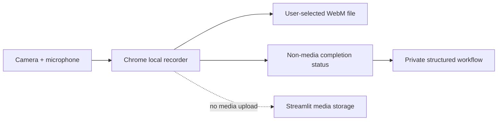

# Browser-Local Recorder Public Showcase Implementation Plan

> **For agentic workers:** REQUIRED SUB-SKILL: Use superpowers:subagent-driven-development (recommended) or superpowers:executing-plans to implement this plan task-by-task. Steps use checkbox (`- [ ]`) syntax for tracking.

**Goal:** Publish a polished README-only public showcase with sanitized workflow animations, step-by-step tutorials, design rationale, and strict protection of private research and source content.

**Architecture:** The public repository contains only Markdown and approved visual assets. Assets are captured from the verified private deployment using synthetic questions and a generated camera/audio scene, then optimized and scanned before publication. The README links to the authorized demo but contains no password or private implementation detail.

**Tech Stack:** GitHub Markdown, Mermaid, desktop Chrome, private Streamlit deployment, Playwright/in-app browser capture when available, ffmpeg or ImageMagick for GIF/WebP optimization, GitHub CLI, PowerShell privacy/allowlist gates.

---

## Preconditions

- Complete the showcase and operational integration plans.
- Verify real Chrome short and long recording with audio and local save.
- The deployed page must contain only neutral synthetic content in showcase mode.
- Do not capture assets from a browser showing personal tabs, notifications,
  profiles, saved paths, passwords, real camera video, or real questionnaire
  data.

## Public Repository

- Local directory: `D:\proj_taVNS\physical-stimulation-session-recorder-showcase`
- GitHub repository: `YaoZeLiu0417/physical-stimulation-session-recorder-showcase`
- Visibility: public
- Allowed top-level files: `.gitignore`, `README.md`, `assets/`
- Allowed assets: the exact GIF/WebP/PNG files named by this plan.

## Approved Asset Inventory

- `assets/workflow-demo.gif`
- `assets/workflow-demo-static.webp`
- `assets/local-recording.gif`
- `assets/local-recording-static.webp`
- `assets/step-01-access.webp`
- `assets/step-02-context.webp`
- `assets/step-03-permissions.webp`
- `assets/step-04-mode.webp`
- `assets/step-05-recording.webp`
- `assets/step-06-local-save.webp`
- `assets/step-07-questionnaire.webp`
- `assets/step-08-confirmation.webp`

No other asset is publishable without updating the design and allowlist review.

## Task 1: Prepare The Strict README-Only Repository

**Files:**
- Create: `D:\proj_taVNS\physical-stimulation-session-recorder-showcase\.gitignore`
- Create: `D:\proj_taVNS\physical-stimulation-session-recorder-showcase\README.md`
- Create directory: `D:\proj_taVNS\physical-stimulation-session-recorder-showcase\assets`

- [ ] **Step 1: Resolve repository state without mutating it**

Use `gh repo view` and `git status` to determine whether the public repository
already exists. If an existing repository contains files outside the allowlist,
stop and report them; do not delete or overwrite user content.

- [ ] **Step 2: Initialize only when absent**

Create the local directory and Git repository only if absent. Create the GitHub
repository only after local privacy gates pass. Do not copy any file from the
private source repository except finalized visual assets produced by this plan.

- [ ] **Step 3: Write the initial ignore and README skeleton**

`.gitignore` contains only common local artifacts:

```gitignore
.DS_Store
Thumbs.db
desktop.ini
*.tmp
```

The README skeleton contains the product name and section headings but no
implementation claims until screenshots and real browser checks exist.

- [ ] **Step 4: Run an exact allowlist gate**

Resolve every tracked/untracked path and fail unless it is `.gitignore`,
`README.md`, or one of the exact approved asset names. Also fail on symlinks,
reparse points, hardlinks, files outside the repository root, and unapproved
extensions.

- [ ] **Step 5: Commit repository scaffolding**

Commit as `docs: scaffold recorder showcase` only after the allowlist passes.

## Task 2: Capture Sanitized Static Workflow Assets

**Files:**
- Create the eight approved `step-*.webp` files.
- Create the two approved `*-static.webp` fallback files.
- Use temporary capture scripts/files outside the public repository.

- [ ] **Step 1: Build a synthetic capture session**

Use the private showcase password without putting it in scripts or command
history. Override media only in the capture browser process with a generated
canvas stream and a silent/synthetic audio track. The visible camera scene must
be a clearly synthetic test pattern with no face, voice, room, or identifier.

- [ ] **Step 2: Lock capture conditions**

Use a 1440x900 desktop viewport, 100% browser zoom, hidden bookmarks/profile UI,
no developer tools in frame, no OS notifications, and only the application
content. Use neutral slider values and never open private admin/score output.

- [ ] **Step 3: Capture all eight steps**

Capture access, context, permissions, mode selection, active recording, local
save, neutral questionnaire, and confirmation. Crop consistently to the app
surface while retaining enough context to understand progress.

- [ ] **Step 4: Produce optimized WebP files**

Resize to at most 1280 pixels wide, preserve readable text, strip metadata,
and target less than 350 KB per image where readability permits. Verify every
image is nonblank and has expected dimensions.

- [ ] **Step 5: Run visual and privacy inspection**

Inspect every file at original resolution. OCR/text-scan where available and
reject any research name, prior abbreviation, real questionnaire label,
participant ID, password, token, local path, account name, notification, score,
or response value.

- [ ] **Step 6: Commit static assets**

Run the exact allowlist again and commit as `docs: add sanitized workflow images`.

## Task 3: Produce Two Optimized Demonstration GIFs

**Files:**
- Create: `assets/workflow-demo.gif`
- Create: `assets/local-recording.gif`

- [ ] **Step 1: Capture deterministic frame sequences**

Capture only the private showcase with synthetic media. The workflow animation
covers overview through confirmation. The local-recording animation focuses on
mode selection, device-ready state, record, timer, stop, playback, and save
confirmation. Do not animate password typing or a real file path.

- [ ] **Step 2: Assemble GIFs with a controlled palette**

Use a two-pass palette workflow, 960-pixel maximum width, 8-12 fps, and short
holds on important states. Do not use decorative transitions that obscure UI
behavior. Keep each GIF under 8 MB and the pair under 14 MB.

- [ ] **Step 3: Verify animation content and fallback parity**

Inspect first, middle, and last frames plus automated canvas/pixel checks.
Verify no blank frames, cropped controls, overlapping text, flashing sensitive
content, or mismatch between GIF and static fallback.

- [ ] **Step 4: Strip metadata, run allowlist/privacy scans, and commit**

Commit as `docs: add local recording walkthroughs` after all gates pass.

## Task 4: Write The Fancy Product README

**Files:**
- Modify: `README.md`

- [ ] **Step 1: Write the first-viewport product section**

Use `Physical Stimulation Session Recorder` as the H1, the workflow GIF with a
static-link fallback, one factual sentence, and three concise signals:
Chrome-local audio/video recording, no media upload, and step-based
questionnaires. Do not use a marketing slogan as the H1.

- [ ] **Step 2: Add the eight-step illustrated walkthrough**

For each step, embed its exact approved WebP and explain the command, visible
state, and successful outcome. Use neutral synthetic labels only. Keep images
unframed and avoid card-inside-card Markdown tables.

- [ ] **Step 3: Explain demonstration and long recording modes**

Embed `local-recording.gif`, compare five-minute memory/download mode with
45-minute direct-write mode, state Chrome requirements, explain WebM/audio,
and warn that an interrupted long file may be incomplete.

- [ ] **Step 4: Add the privacy/data-flow Mermaid diagram**

Use this structure without internal module names:



Explain that participant scores remain hidden and the public showcase contains
no study content.

- [ ] **Step 5: Add the complete Chrome tutorial**

Document access request, browser/device requirements, permission prompts,
device selection, microphone meter, short record/download, long destination
selection, stop/save confirmation, questionnaire completion, restart, and
where downloaded files are found without exposing an actual local path.

- [ ] **Step 6: Add troubleshooting**

Cover camera/microphone denial, busy devices, missing audio meter, unsupported
format, cancelled picker, disk/write failure, incomplete interrupted files,
and how to release device permissions. Never instruct users to disable browser
security or upload recordings for support.

- [ ] **Step 7: Add design rationale**

Show the approved swatches as deep navy `#000035`, violet `#2D2674`, pink
`#DD1D86`, blue `#33B0E4`, peach `#FFBC7D`, white, and neutral gray. Explain
the quiet step flow, stable 16:9 recorder, slider controls, restrained status
accents, accessibility, and the no-score participant boundary. Do not claim
affiliation with the referenced inspiration site.

- [ ] **Step 8: Add authorized demo access**

Link to the deployed app as an authorized demonstration. State that access is
controlled and direct readers to the lab team; do not publish passwords,
private repository URLs, internal contacts not approved for public use, or
Streamlit Secret instructions.

- [ ] **Step 9: Verify README content and commit**

Run prohibited-term, credential, local-path, Markdown-link, image-alt,
allowlist, and file-size checks. Commit as `docs: publish recorder showcase guide`.

## Task 5: Render And Inspect The GitHub README

**Files:**
- Modify assets/README only if visual defects are found.

- [ ] **Step 1: Push a review branch to the public repository**

Do not merge to public main yet. Inspect the rendered GitHub README in an
anonymous session.

- [ ] **Step 2: Verify desktop and mobile widths**

Capture 1440x900 and 390x844 screenshots. Check H1 hierarchy, GIF load,
readability, no horizontal overflow, no clipped longest Chinese/English word,
working anchor navigation, and no incoherent overlap.

- [ ] **Step 3: Verify all media and links**

Check every approved image returns 200, GIFs animate, static fallbacks render,
Mermaid renders, alt text is useful, and the authorized demo link reaches its
authentication boundary.

- [ ] **Step 4: Re-run privacy inspection on rendered output**

Inspect visible text, image pixels, raw asset URLs, commit diff, repository
description, topics, and social preview. Reject any private term, participant
content, credential, password, score, response, path, or source reference.

## Task 6: Publish And Reconfirm Boundaries

**Files:**
- Verify exact public repository contents.

- [ ] **Step 1: Run final local gates**

Require clean status, exact allowlist, no symlinks/reparse/hardlinks, all asset
size/dimension/metadata checks, prohibited-content scan, and valid Markdown
links.

- [ ] **Step 2: Request spec and visual-quality review**

Review README completeness, tutorial accuracy, privacy, aesthetics, and
responsive screenshots. Fix all Critical/Important issues and repeat review.

- [ ] **Step 3: Merge the public README PR**

Verify exact diff, configured checks or fresh local gates, merge, and delete the
remote feature branch.

- [ ] **Step 4: Verify anonymously after merge**

Confirm the repository and every README asset are public, source-like paths are
404, the rendered README is complete, and the private source repository/raw
files remain anonymous 404.

## Agent Retry Rule

If an implementation, capture, or review subagent fails specifically with HTTP
`429`, wait 5-10 seconds and retry the same bounded task. Do not lower privacy,
image, or code gates because of an agent-service rate limit.
