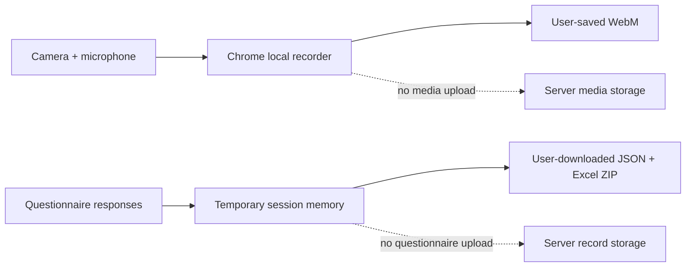

# Fancy Public Showcase README Implementation Plan

> **For agentic workers:** REQUIRED SUB-SKILL: Use superpowers:subagent-driven-development (recommended) or superpowers:executing-plans to implement this plan task-by-task. Steps use checkbox (`- [ ]`) syntax for tracking.

**Goal:** Publish a polished README-only public repository with sanitized workflow images, two GIF walkthroughs, a complete Chrome/local-download tutorial, and strict protection of the private study and source repository.

**Architecture:** The private source repository owns a fail-closed auditor and temporary capture tooling. A separate repository contains only Markdown and an exact visual-asset allowlist. All captures come from a local synthetic showcase session using fake camera/audio media; no private password, real study content, participant data, source, or path enters public history.

**Tech Stack:** GitHub Markdown, Mermaid, local Streamlit showcase, desktop Chrome/Playwright with fake media, ffmpeg/ImageMagick for GIF/WebP, private Python privacy audit, GitHub CLI.

---

## Preconditions

- Complete and deploy `2026-07-27-session-only-questionnaire-export.md` and `2026-07-27-synthetic-showcase-export.md`.
- Verify the private showcase downloads a synthetic JSON+Excel ZIP in real Chrome.
- Public target: `YaoZeLiu0417/physical-stimulation-session-recorder-showcase`.
- Local public path: `D:\proj_taVNS\physical-stimulation-session-recorder-showcase`.
- The target repository is currently absent; re-check immediately before creation.
- Never copy private Git history, source files, tests, configs, questionnaire text, PDFs, spreadsheets, secrets, or local paths into the public repository.

## Exact Public Allowlist

```text
.gitignore
README.md
assets/workflow-demo.gif
assets/workflow-demo-static.webp
assets/local-recording.gif
assets/local-recording-static.webp
assets/step-01-access.webp
assets/step-02-overview.webp
assets/step-03-permissions.webp
assets/step-04-mode.webp
assets/step-05-recording.webp
assets/step-06-local-video-save.webp
assets/step-07-synthetic-feedback.webp
assets/step-08-local-zip-download.webp
assets/step-09-confirmation.webp
```

No additional public file or asset is allowed without updating the approved
design, auditor, tests, and this plan.

## Task 1: Upgrade The Private Public-Tree Auditor

**Files:**
- Modify: `showcase_audit.py`
- Modify: `tests/test_showcase_audit.py`

- [ ] **Step 1: Write failing binary-asset allowlist tests**

Replace the old SVG allowlist with the exact files above. Create minimal valid
GIF/WebP fixtures and assert the auditor:

- accepts regular files with the correct extension and signature;
- rejects missing, extra, symlink, reparse, hardlink, and special entries;
- rejects a GIF/WebP with the wrong signature;
- scans textual metadata bytes for prohibited terms, credentials, paths, and
  URLs without decoding the entire binary as UTF-8;
- continues full UTF-8/URL/credential checks for README and `.gitignore`.

- [ ] **Step 2: Verify RED**

```powershell
python -m pytest tests/test_showcase_audit.py -q
```

Expected: the old auditor requires one SVG and treats binary assets as UTF-8.

- [ ] **Step 3: Implement typed asset rules**

Define exact mappings:

```python
TEXT_FILES = frozenset({".gitignore", "README.md"})
GIF_FILES = frozenset({"assets/workflow-demo.gif", "assets/local-recording.gif"})
WEBP_FILES = frozenset({
    "assets/workflow-demo-static.webp",
    "assets/local-recording-static.webp",
    "assets/step-01-access.webp",
    "assets/step-02-overview.webp",
    "assets/step-03-permissions.webp",
    "assets/step-04-mode.webp",
    "assets/step-05-recording.webp",
    "assets/step-06-local-video-save.webp",
    "assets/step-07-synthetic-feedback.webp",
    "assets/step-08-local-zip-download.webp",
    "assets/step-09-confirmation.webp",
})
PUBLIC_FILES = tuple(sorted(TEXT_FILES | GIF_FILES | WEBP_FILES))
```

Validate GIF signatures `GIF87a/GIF89a` and WebP `RIFF....WEBP`. Binary scans
must report categories/paths only, never echo matched bytes.

- [ ] **Step 4: Verify and commit**

```powershell
python -m pytest tests/test_showcase_audit.py -q
python -m compileall -q showcase_audit.py tests/test_showcase_audit.py
git diff --check
git add showcase_audit.py tests/test_showcase_audit.py
git commit -m "test: audit fancy showcase assets"
```

## Task 2: Scaffold The Independent Public Repository

**Files:**
- Create: `D:\proj_taVNS\physical-stimulation-session-recorder-showcase\.gitignore`
- Create: `D:\proj_taVNS\physical-stimulation-session-recorder-showcase\README.md`
- Create directory: `D:\proj_taVNS\physical-stimulation-session-recorder-showcase\assets`

- [ ] **Step 1: Re-check target state without mutation**

```powershell
gh repo view YaoZeLiu0417/physical-stimulation-session-recorder-showcase --json visibility,url
Test-Path D:\proj_taVNS\physical-stimulation-session-recorder-showcase
```

Expected: GitHub returns not found and the local directory is absent. If either
exists, inspect and stop on any content outside the allowlist; do not overwrite.

- [ ] **Step 2: Create a history-isolated local repository**

Initialize only the new directory. `.gitignore` contains:

```gitignore
.DS_Store
Thumbs.db
desktop.ini
*.tmp
```

Create a README skeleton with the H1 and approved section headings only; do not
claim screenshots/GIFs exist before they pass inspection.

- [ ] **Step 3: Commit the scaffold**

```powershell
git init
git add .gitignore README.md
git commit -m "docs: scaffold recorder showcase"
```

Do not create the GitHub repository yet.

## Task 3: Create A Synthetic Capture Environment

**Files:**
- Create temporary scripts/media under `D:\proj_taVNS\tmp\showcase-capture-<token>` only.
- Do not create capture scripts in the public repository.

- [ ] **Step 1: Generate fake media**

Use ffmpeg to generate a clearly synthetic 1280x720 test-pattern Y4M and a low
volume synthetic WAV tone. No real camera, face, room, microphone, or voice is
used.

```powershell
ffmpeg -f lavfi -i testsrc2=size=1280x720:rate=30 -t 60 -pix_fmt yuv420p synthetic-camera.y4m
ffmpeg -f lavfi -i sine=frequency=440:sample_rate=48000 -t 60 -filter:a "volume=0.03" synthetic-audio.wav
```

- [ ] **Step 2: Start a local showcase with a throwaway password**

Set a temporary `SHOWCASE_PASSWORD_SHA256` for local capture only and start
`streamlit run showcase_app.py` on an unused localhost port. Do not use or log
the deployed password. Authenticate before any capture context/video recording
begins.

- [ ] **Step 3: Launch Chrome with fake devices**

Use a temporary Chrome profile and fake-media flags:

```text
--use-fake-device-for-media-stream
--use-file-for-fake-video-capture=<validated-y4m-path>
--use-file-for-fake-audio-capture=<validated-wav-path>
--no-first-run
```

Use a 1440x900 viewport, 100% zoom, hidden bookmarks/profile UI, no devtools in
frame, and the application surface only. Never capture the password page or OS
file picker.

- [ ] **Step 4: Verify fake-media privacy**

Record a short local WebM and verify it contains synthetic video/audio. Inspect
captured pixels and audio source before continuing. Delete failed temporary
captures outside the public repository.

## Task 4: Capture And Optimize Nine Static Steps

**Files:**
- Create the nine exact `assets/step-*.webp` files.
- Create `assets/workflow-demo-static.webp` and `assets/local-recording-static.webp`.

- [ ] **Step 1: Capture deterministic application states**

Capture access boundary after authentication, overview, permissions, mode,
active recording, local video save, synthetic feedback, local ZIP download,
and confirmation. The access image shows the controlled-access result, not
password entry.

- [ ] **Step 2: Normalize and optimize**

Crop consistently to the Streamlit app, resize to at most 1280 pixels wide,
strip metadata, use WebP, and target less than 350 KB per step where text
remains legible. Generate the two static fallbacks from representative frames.

- [ ] **Step 3: Run pixel, OCR, metadata, and manual checks**

Require nonblank dimensions, no clipping/overlap, no profile/browser chrome,
and no prohibited research term, participant value, password, token, path,
account, notification, score, or real question text. Inspect every image at
original resolution.

- [ ] **Step 4: Copy only finalized files and commit**

Run signature, metadata, OCR/manual, prohibited-term, and regular-file checks
against this static-asset batch. Do not run the final exact-tree audit yet,
because the two required GIFs are intentionally added in Task 5. Then:

```powershell
git add assets
git commit -m "docs: add sanitized workflow images"
```

## Task 5: Produce Two Sanitized GIF Walkthroughs

**Files:**
- Create: `assets/workflow-demo.gif`
- Create: `assets/local-recording.gif`

- [ ] **Step 1: Capture frame sequences after authentication**

The workflow GIF covers overview through synthetic ZIP confirmation. The local
recording GIF covers device-ready, record, timer, stop, local playback/download,
and save confirmation. Assemble deterministic screenshots or start recording
only after the password state has disappeared.

- [ ] **Step 2: Build controlled-palette GIFs**

Use two-pass ffmpeg palette generation, maximum width 960, 8-12 fps, and short
holds on key states. Keep each under 8 MB and the pair under 14 MB.

- [ ] **Step 3: Inspect the full animation**

Extract all frames or representative frames at every transition. Reject blank
frames, flashes, clipped controls, file-picker frames, path/user-name exposure,
or private text retained between states. Confirm static fallbacks match.

- [ ] **Step 4: Audit and commit**

With both GIFs now present, run the final exact-tree auditor and require the
complete public allowlist to pass before committing.

```powershell
git add assets/workflow-demo.gif assets/local-recording.gif
git commit -m "docs: add synthetic workflow animations"
```

## Task 6: Write The Fancy Product README

**Files:**
- Modify: `README.md`

- [ ] **Step 1: Write the first viewport**

Use `# Physical Stimulation Session Recorder`, embed the workflow GIF with a
static fallback link, and state three factual signals: Chrome-local audio/video,
local JSON+Excel questionnaire ZIP, and no media/questionnaire upload. Do not
use a marketing slogan as the H1.

- [ ] **Step 2: Add the nine-step illustrated walkthrough**

Embed each exact WebP in order. Explain the visible action and successful state
using synthetic terms only. Keep images full-width/unframed; do not use nested
Markdown cards or tables for the walkthrough.

- [ ] **Step 3: Explain recording and export modes**

Embed `local-recording.gif`; compare five-minute demonstration memory/download
mode with 45-minute direct-write mode. Explain WebM/audio, the local video save,
the JSON/Excel ZIP, and interrupted-file limitations.

- [ ] **Step 4: Add the privacy Mermaid diagram**



State that participant scores are not displayed or included and public images
contain no real questionnaire content.

- [ ] **Step 5: Add complete Chrome tutorial and troubleshooting**

Cover controlled access, permissions, device selection, microphone meter,
short/long recording, local video save, synthetic questionnaire, ZIP download,
local-save confirmation, restart, camera denial, busy devices, missing audio,
picker cancellation, disk/write failure, incomplete files, download retry, and
device release. Never recommend disabling browser security or uploading files
for support.

- [ ] **Step 6: Add design rationale and controlled access**

Show the approved navy/violet/pink/blue/peach swatches, quiet step flow,
sliders, stable 16:9 recorder, focus states, and no-score boundary. State that
the visual direction is inspired by restrained neuroscience product design and
does not claim affiliation. Link the controlled demonstration without a
password or private repository URL.

- [ ] **Step 7: Run README gates and commit**

Check Markdown links, headings, alt text, image references, Mermaid syntax,
prohibited terms, credentials, paths, and exact allowlist.

```powershell
git add README.md
git commit -m "docs: publish recorder showcase guide"
```

## Task 7: Render, Review, And Publish

**Files:**
- Modify only README/assets if review finds defects.

- [ ] **Step 1: Render locally at desktop and mobile widths**

Render/capture the README at 1440x900 and 390x844. Check H1 hierarchy, GIF
loading, fallback visibility, Mermaid rendering, readable text, no horizontal
overflow, no clipped long word, and working links.

- [ ] **Step 2: Run final local privacy gates**

Require clean status, exact allowlist, regular files only, valid signatures,
asset size/dimension/metadata limits, full animation inspection, OCR/manual
review, valid links, and no prohibited content anywhere in current history.

- [ ] **Step 3: Request spec and visual-quality review**

Fix every Critical/Important README, privacy, responsive, or asset issue and
repeat review.

- [ ] **Step 4: Create and push the public repository**

Only after all gates pass:

```powershell
gh repo create YaoZeLiu0417/physical-stimulation-session-recorder-showcase --public --source . --remote origin --push
```

Set a neutral description and approved topics only after scanning them for
private terms.

- [ ] **Step 5: Verify anonymously**

Confirm the repository and every allowlisted asset return 200, GIFs animate,
the README/Mermaid render, the controlled demo reaches its auth boundary, and
source-like paths return 404. Reconfirm the private source repository remains
private and anonymous raw source remains 404.

## Agent Retry Rule

If an implementation, capture, or review subagent fails specifically with HTTP
`429`, wait 5-10 seconds and retry the same bounded task. Never weaken privacy,
asset, or visual gates because of an agent-service rate limit.
